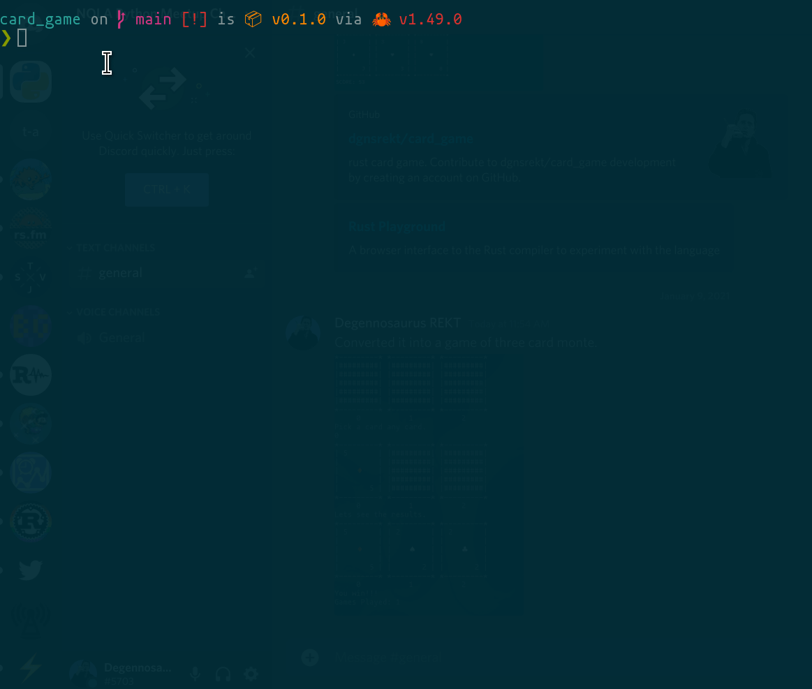

# Find the high card.



## Project Structure Overview

```
card_game/
├── Cargo.toml          # Rust package manifest with dependencies
├── Cargo.lock          # Dependency lock file
├── README.md           # This file
├── img/
│   └── example.gif     # Demo animation of gameplay
└── src/
    ├── main.rs         # Main game logic and entry point
    ├── cards.rs        # Card types, deck builder, and display logic
    └── snapshots/      # Insta framework test snapshots
        ├── card_game__cards__tests__card_value.snap
        ├── card_game__cards__tests__nomenclature.snap
        └── card_game__cards__tests__rank_suit_display.snap
```

### Key Components

- **`src/main.rs`**: Contains the main game loop, `Game` struct for managing game state, and `GameBuilder` for game initialization
- **`src/cards.rs`**: Implements `Card` struct, `DeckBuilder` for creating a standard 52-card deck, and card display utilities
- **Dependencies**:
  - `rand`: For shuffling cards and random selection
  - `ansi_term`: For colored terminal output
  - `insta`: For snapshot testing

### How It Works

This is a simple card guessing game where players try to find the highest card among three face-down cards. The game tracks wins and total games played until the deck runs out of cards.
